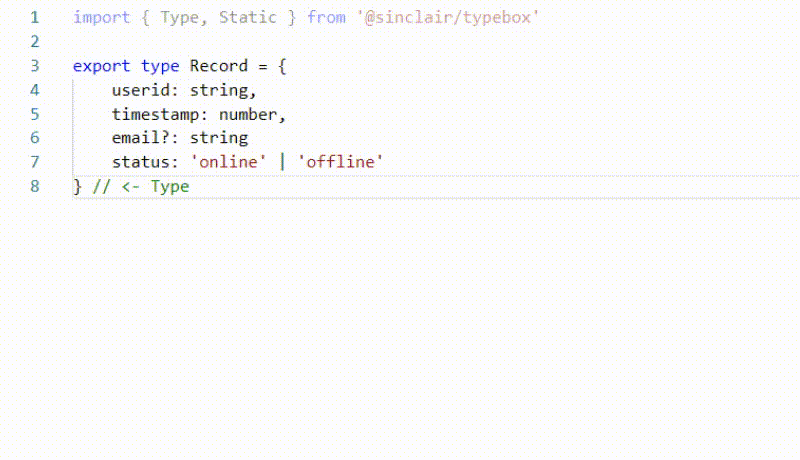

<div align='center'>

<h1>TypeBox</h1>

<p>JSONSchema Type Builder with Static Type Resolution for TypeScript</p>

[](https://badge.fury.io/js/%40sinclair%2Ftypebox)
[](https://travis-ci.org/sinclairzx81/TypeBox)

</img>

</div>

<a name="Install"></a>

## Install

```bash
$ npm install @sinclair/typebox --save
```

<a name="Overview"></a>

## Overview

TypeBox is a type builder library that allows developers to compose complex in-memory JSONSchema objects that can be resolved to static TypeScript types. The schemas produced by TypeBox can be used directly as validation schemas or reflected upon by navigating the standard JSONSchema properties at runtime. TypeBox can be used as a simple tool to build complex schemas or integrated into RPC or REST services to help validate JSON data received over the wire.

TypeBox does not provide any mechanism for validating JSONSchema. Please refer to libraries such as [AJV](https://www.npmjs.com/package/ajv) or similar to validate the schemas created with this library.

Requires TypeScript 3.8.3 and above.

License MIT

## Contents
- [Install](#Install)
- [Overview](#Overview)
- [Example](#Example)
- [Types](#Types)
- [More Types](#Intrinsics)
- [Functions](#Functions)
- [Generics](#Generics)
- [Validation](#Validation)

## Example

The following shows the general usage.

```typescript
import { Type, Static } from '@sinclair/typebox'

// Some type...

type Order = {
    email:    string,
    address:  string,
    quantity: number,
    option:   'pizza' | 'salad' | 'pie'
}

// ...can be expressed as...

const Order = Type.Object({
    email:    Type.Format('email'), 
    address:  Type.String(),
    quantity: Type.Range(1, 99),
    option:   Type.Union(
        Type.Literal('pizza'), 
        Type.Literal('salad'),
        Type.Literal('pie')
    )
})

// ... which can be reflected

console.log(JSON.stringify(Order, null, 2))

// ... and statically resolved

type TOrder = Static<typeof Order>

// .. and validated as JSONSchema

JSON.validate(Order, {  // IETF | TC39 ?
    email: 'dave@domain.com', 
    address: '...', 
    quantity: 99, 
    option: 'pie' 
}) 

// ... and so on ...
```

<a href='Types'></a>

## Types

TypeBox provides many functions generate JSONschema data types. The following tables list the functions TypeBox provides and their respective TypeScript and JSONSchema equivalents. 

### TypeBox > TypeScript

<table>
    <thead>
        <tr>
            <th>Type</th>
            <th>TypeBox</th>
            <th>TypeScript</th>
        </tr>
    </thead>
    <tbody>
        <tr>
            <td>Optional</td>
            <td><code>const T = Type.Object({ email: Type.Optional(Type.String()) })</code></td>
            <td><code>type T = { email?: string }</code></td>
        </tr>       
        <tr>
            <td>Readonly</td>
            <td><code>const T = Type.Object({ email: Type.Readonly(Type.String()) })</code></td>
            <td><code>type T = { readonly email: string }</code></td>
        </tr>
        <tr>
            <td>Literal</td>
            <td><code>const T = Type.Literal(123)</code></td>
            <td><code>type T = 123</code></td>
        </tr>
        <tr>
            <td>String</td>
            <td><code>const T = Type.String()</code></td>
            <td><code>type T = string</code></td>
        </tr>
        <tr>
            <td>Number</td>
            <td><code>const T = Type.Number()</code></td>
            <td><code>type T = number</code></td>
        </tr>
        <tr>
            <td>Boolean</td>
            <td><code>const T = Type.Boolean()</code></td>
            <td><code>type T = boolean</code></td>
        </tr>
        <tr>
            <td>Object</td>
            <td><code>const T = Type.Object({ name: Type.String() })</code></td>
            <td><code>type T = { name: string }</code></td>
        </tr>
        <tr>
            <td>Array</td>
            <td><code>const T = Type.Array(Type.Number())</code></td>
            <td><code>type T = number[]</code></td>
        </tr>
        <tr>
            <td>Map</td>
            <td><code>const T = Type.Map(Type.Number())</code></td>
            <td><code>type T = { [key: string] } : number</code></td>
        </tr>
        <tr>
            <td>Intersect</td>
            <td><code>const T = Type.Intersect(Type.String(), Type.Number())</code></td>
            <td><code>type T = string & number</code></td>
        </tr>
        <tr>
            <td>Union</td>
            <td><code>const T = Type.Union(Type.String(), Type.Number())</code></td>
            <td><code>type T = string | number</code></td>
        </tr>
        <tr>
            <td>Tuple</td>
            <td><code>const T = Type.Tuple(Type.String(), Type.Number())</code></td>
            <td><code>type T = [string, number]</code></td>
        </tr>
        <tr>
            <td>Any</td>
            <td><code>const T = Type.Any()</code></td>
            <td><code>type T = any</code></td>
        </tr>
        <tr>
            <td>Null</td>
            <td><code>const T = Type.Null()</code></td>
            <td><code>type T = null</code></td>
        </tr>
        <tr>
            <td>Pattern</td>
            <td><code>const T = Type.Pattern(/foo/)</code></td>
            <td><code>type T = string</code></td>
        </tr>
        <tr>
            <td>Range</td>
            <td><code>const T = Type.Range(20, 30)</code></td>
            <td><code>type T = number</code></td>
        </tr>
        <tr>
            <td>Format</td>
            <td><code>const T = Type.Format('date-time')</code></td>
            <td><code>type T = string</code></td>
        </tr>
        <tr>
            <td>Guid</td>
            <td><code>const T = Type.Guid()</code></td>
            <td><code>type T = string</code></td>
        </tr>
    </tbody>
</table>

### TypeBox > JSONSchema

<table>
    <thead>
        <tr>
            <th>Type</th>
            <th>TypeBox</th>
            <th>JSONSchema</th>
        </tr>
    </thead>
    <tbody>
        <tr>
            <td>Literal</td>
            <td><code>const T = Type.Literal(123)</code></td>
            <td><code>{ type: 'number', enum: [123] }</code></td>
        </tr>       
        <tr>
            <td>String</td>
            <td><code>const T = Type.String()</code></td>
            <td><code>{ type: 'string' }</code></td>
        </tr>
        <tr>
            <td>Number</td>
            <td><code>const T = Type.Number()</code></td>
            <td><code>{ type: 'number' }</code></td>
        </tr>
        <tr>
            <td>Boolean</td>
            <td><code>const T = Type.Boolean()</code></td>
            <td><code>{ type: 'boolean' }</code></td>
        </tr>
        <tr>
            <td>Object</td>
            <td><code>const T = Type.Object({ name: Type: String() })</code></td>
            <td><code>{ type: 'object': properties: { name: { type: 'string' } }, required: ['name'] }</code></td>
        </tr>
        <tr>
            <td>Array</td>
            <td><code>const T = Type.Array(Type.String())</code></td>
            <td><code>{ type: 'array': items: { type: 'string' } }</code></td>
        </tr>
        <tr>
            <td>Map</td>
            <td><code>const T = Type.Map(Type.Number())</code></td>
            <td><code>{ type: 'object', additionalProperties: { type: 'number' } }</code></td>
        </tr>
        <tr>
            <td>Intersect</td>
            <td><code>const T = Type.Intersect(Type.Number(), Type.String())</code></td>
            <td><code>{ allOf: [{ type: 'number'}, {type: 'string'}] }</code></td>
        </tr>
        <tr>
            <td>Union</td>
            <td><code>const T = Type.Union(Type.Number(), Type.String())</code></td>
            <td><code>{ oneOf: [{ type: 'number'}, {type: 'string'}] }</code></td>
        </tr>
        <tr>
            <td>Tuple</td>
            <td><code>const T = Type.Tuple(Type.Number(), Type.String())</code></td>
            <td><code>{ type: "array", items: [{type: 'string'}, {type: 'number'}], additionalItems: false, minItems: 2, maxItems: 2 }</code></td>
        </tr>
        <tr>
            <td>Any</td>
            <td><code>const T = Type.Any()</code></td>
            <td><code>{ }</code></td>
        </tr>
        <tr>
            <td>Null</td>
            <td><code>const T = Type.Null()</code></td>
            <td><code>{ type: 'null' }</code></td>
        </tr>
        <tr>
            <td>Pattern</td>
            <td><code>const T = Type.Pattern(/foo/)</code></td>
            <td><code>{ type: 'string', pattern: 'foo' }</code></td>
        </tr>
        <tr>
            <td>Range</td>
            <td><code>const T = Type.Range(20, 30)</code></td>
            <td><code>{ type: 'number', minimum: 20, maximum: 30 }</code></td>
        </tr>
        <tr>
            <td>Format</td>
            <td><code>const T = Type.Format('date-time')</code></td>
            <td><code>{ type: 'string',format: 'date-time' }</code></td>
        </tr>
        <tr>
            <td>Guid</td>
            <td><code>const T = Type.Guid()</code></td>
            <td><code>{ type: 'string', format: '<guid-regex>' }</code></td>
        </tr>
    </tbody>
</table>


<a name="Intrinsics"></a>

## More Types

In addition to the JSONSchema functions, TypeBox also provides some non-standard schemas that provide reflectable metadata for function signatures. These functions allow TypeBox to express `function` and `constructor` signatures where the arguments and return types may be JSONSchema.

For more information on their use, see the [Functions](#Functions) and [Generics](#Generics) sections below.

### TypeBox > TypeScript

<table>
    <thead>
        <tr>
            <th>Intrinsic</th>
            <th>TypeBox</th>
            <th>TypeScript</th>
        </tr>
    </thead>
    <tbody>
        <tr>
            <td>Function</td>
            <td><code>const T = Type.Function([Type.String()], Type.String())</code></td>
            <td><code>type T = (arg0: string) => string</code></td>
        </tr>  
        <tr>
            <td>Constructor</td>
            <td><code>const T = Type.Constructor([Type.String()], Type.String())</code></td>
            <td><code>type T = new (arg0: string) => string</code></td>
        </tr>      
        <tr>
            <td>Promise</td>
            <td><code>const T = Type.Promise(Type.String())</code></td>
            <td><code>type T = Promise&lt;string&gt;</code></td>
        </tr>
        <tr>
            <td>Undefined</td>
            <td><code>const T = Type.Undefined()</code></td>
            <td><code>type T = undefined</code></td>
        </tr>
        <tr>
            <td>Void</td>
            <td><code>const T = Type.Void()</code></td>
            <td><code>type T = void</code></td>
        </tr>
    </tbody>
</table>

### TypeBox > TypeBox Schema

<table>
    <thead>
        <tr>
            <th>Intrinsic</th>
            <th>TypeBox</th>
            <th>TypeScript</th>
        </tr>
    </thead>
    <tbody>
        <tr>
            <td>Function</td>
            <td><code>const T = Type.Function([Type.String()], Type.Number())</code></td>
            <td><code>{ type: 'function', arguments: [ { type: 'string' } ], returns: { type: 'number' } }</code></td>
        </tr>
        <tr>
            <td>Constructor</td>
            <td><code>const T = Type.Constructor([Type.String()], Type.Number())</code></td>
            <td><code>{ type: 'constructor', arguments: [ { type: 'string' } ], returns: { type: 'number' } }</code></td>
        </tr>
        <tr>
            <td>Promise</td>
            <td><code>const T = Type.Promise(Type.String())</code></td>
            <td><code>{ type: 'promise', item: { type: 'string' } }</code></td>
        </tr>
        <tr>
            <td>Undefined</td>
            <td><code>const T = Type.Undefined()</code></td>
            <td><code>{ type: 'undefined' }</code></td>
        </tr>
        <tr>
            <td>Void</td>
            <td><code>const T = Type.Void()</code></td>
            <td><code>{ type: 'void' }</code></td>
        </tr>
    </tbody>
</table>

<a href='Functions'></a>

## Functions

The following demonstrates creating function signatures for the following TypeScript types.

### TypeScript

```typescript
type T0 = (a0: number, a1: string) => boolean;

type T1 = (a0: string, a1: () => string) => void;

type T2 = (a0: string) => Promise<number>;

type T3 = () => () => string;

type T4 = new () => string
```

### TypeBox

```typescript
const T0 = Type.Function([Type.Number(), Type.String()], Type.Boolean())

const T1 = Type.Function([Type.String(), Type.Function([], Type.String())], Type.Void())

const T2 = Type.Function([Type.String()], Type.Promise(Type.Number()))

const T3 = Type.Function([], Type.Function([], Type.String()))

const T4 = Type.Constructor([], Type.String())
```

<a name="Generics"></a>

## Generics

Generic function signatures can be composed with TypeScript functions with [Generic Constraints](https://www.typescriptlang.org/docs/handbook/generics.html#generic-constraints).

### TypeScript
```typescript
type ToString = <T>(t: T) => string
```
### TypeBox
```typescript
import { Type, Static, TStatic } from '@sinclair/typebox'

const ToString = <G extends TStatic>(T: G) => Type.Function([T], Type.String())
```
However, it's not possible to statically infer what type `ToString` is without first creating some specialized variant of it. The following creates a specialization called `NumberToString`.
```typescript
const NumberToString = ToString(Type.Number())

type X = Static<typeof NumberToString>

// X is (arg0: number) => string
```
 To take things a bit further, the following code contains some generic TypeScript REST setup with controllers that take some generic resource of type `T`. Below this we expresses that same setup using TypeBox. The resulting type `IRecordController` contains reflectable metadata about the `RecordController`.
### TypeScript
```typescript
interface IController<T> {
    get    (): Promise<T>
    post   (resource: T): Promise<void>
    put    (resource: T): Promise<void>
    delete (resource: T): Promise<void>
}

interface Record {
     key: string
     value: string
}

class StringController implements IController<Record> {
    async get   (): Promise<Record> { throw 'not implemented' }
    async post  (resource: Record): Promise<void> { /* */  }
    async put   (resource: Record): Promise<void> { /* */  }
    async delete(resource: Record): Promise<void> { /* */  }
}
```

### TypeBox

```typescript
import { Type, Static, TStatic } from '@sinclair/typebox'

const IController = <G extends TStatic>(T: G) => Type.Object({
    get:    Type.Function([], Type.Promise(T)),
    post:   Type.Function([T], Type.Promise(Type.Void())),
    put:    Type.Function([T], Type.Promise(Type.Void())),
    delete: Type.Function([T], Type.Promise(Type.Void())),
})

type Record = Static<typeof Record>
const Record = Type.Object({
    key: Type.String(),
    value: Type.String()
})

type IRecordController = Static<typeof IRecordController>
const IRecordController = IController(Record)

class RecordController implements IRecordController {
    async get   (): Promise<Record> { throw 'not implemented' }
    async post  (resource: Record): Promise<void> { /* */  }
    async put   (resource: Record): Promise<void> { /* */  }
    async delete(resource: Record): Promise<void> { /* */  }
}

// Reflect !!
console.log(IRecordController)
```
<a href='Validation'></a>

## Validation

The following uses the library [Ajv](https://www.npmjs.com/package/ajv) to validate a type.

```typescript
import * Ajv from 'ajv'

const ajv = new Ajv({ })

ajv.validate(Type.String(), 'hello')  // true

ajv.validate(Type.String(), 123)      // false
```
