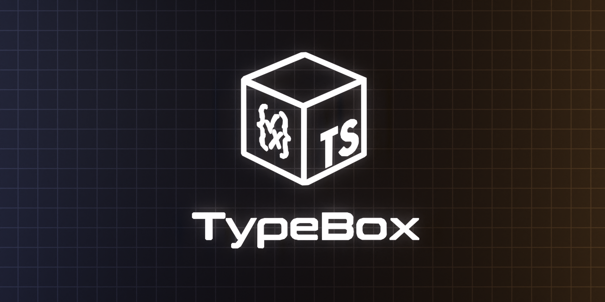

<div align='center'>

<h1>TypeBox</h1>

<p>JSON Schema Type Builder with Static Type Resolution for TypeScript</p>



<br />
<br />

[](https://badge.fury.io/js/typebox)
[](https://www.npmjs.com/package/typebox)
[](https://github.com/sinclairzx81/typebox/actions/workflows/build.yml)
[](https://opensource.org/licenses/MIT)

</div>

## Install

```bash
$ npm install typebox
```


## Usage

```typescript
import Type from 'typebox'

const T = Type.Object({                     // const T = {
  x: Type.Number(),                         //   type: 'object',
  y: Type.Number(),                         //   properties: {
  z: Type.Number()                          //     x: { type: 'number' },
})                                          //     y: { type: 'number' },
                                            //     z: { type: 'number' }
                                            //   },
                                            //   required: ['x', 'y', 'z']
                                            // }

type T = Type.Static<typeof T>              // type T = {
                                            //   x: number,
                                            //   y: number,
                                            //   z: number
                                            // }
```

## Overview

[Documentation](https://sinclairzx81.github.io/typebox/)

TypeBox is a runtime type system that creates in-memory JSON Schema objects that infer as TypeScript types. The schematics produced by this library are designed to match the static type checking rules of the TypeScript compiler. TypeBox offers a unified type system that can be statically checked by TypeScript and validated at runtime using standard JSON Schema.

This library is designed to allow JSON Schema to compose similar to how types compose within TypeScript's type system. It can be used as a simple tool to build up complex schematics or integrated into REST and RPC services to help validate data received over the wire.

License: MIT

## Contents

- [Type](#Type)
- [Script](#Script)
- [Schema](#Schema)
- [Versions](#Versions)
- [Contribute](#Contribute)


<a name="Type"></a>

## Type

[Documentation](https://sinclairzx81.github.io/typebox/#/docs/type/overview) | [Example](https://www.typescriptlang.org/play/?#code/JYWwDg9gTgLgBAFQJ5gKZwGZQiOByGFVAIwgA88AoSgehrgFonmXW32POvueHb7kafo16ix4ic2oBjCADsAzvACqC1FDgBeREQB0AeWIArVNJgAKAN5wbtu-Yc26cWYpVqN2y5RvAAJgBcOmi6AMowUMByAObmAJQANI7JKfbONoRoQXgQxqYweAk+cHIAhiCoQYKoYRFRsYmpTQ7pcGDYaLDAqApB3jaoIKXAADZVeuGRMVaY0EMw2YPDI3hwAL5xya2+gXDWmZX4SlPRq2tFG81X11v0dmUVfXAH2cf1Z0U3X99w23BLoyexR+INSfwyRFedRihTgwNBCLSd3sGDmpQW+ABKzhiNxdj+a3heIRrUJxLxrSgqAAjgBXYBU3YAbSJ5J+fzw-lhrLZXw5D1Q3N5JORNjwWKowtBrQAujypc1nIThJJVWr1XxnOF0cBpCqNQbDZxqAc4Kp1FpgjVtTBdQAeA4QDBmjwAPmuzlN5s8e3lCqarX8QTeMU+-u+rQFweh0TD4ZurSx0ZOfvjjiVQA)

TypeBox types are JSON Schema fragments that can compose into more complex types. The library offers a set of types used to construct JSON Schema compliant schematics as well as a set of extended types used to model constructs native to the JavaScript language. The schematics produced by TypeBox can be passed directly to any JSON Schema compliant validator.

## Example

The following creates a User type and infers with Static.

```typescript
import Type from 'typebox'

// -------------------------------------------------------------------------------
// Type
// -------------------------------------------------------------------------------

const User = Type.Object({                       // const User = {
  id: Type.String(),                             //   type: 'object',
  name: Type.String(),                           //   properties: {
  email: Type.String({ format: 'email' })        //     id: { type: 'string' },
})                                               //     name: { type: 'string' },
                                                 //     email: { 
                                                 //       type: 'string', 
                                                 //       format: 'email' 
                                                 //     }
                                                 //   }
                                                 //   required: [
                                                 //     'id', 
                                                 //     'name', 
                                                 //     'email'
                                                 //   ]
                                                 // }

// -------------------------------------------------------------------------------
// Static
// -------------------------------------------------------------------------------

type User = Type.Static<typeof User>              // type User = {
                                                  //   id: string,
                                                  //   name: string,
                                                  //   email: string
                                                  // }
```

## Script

[Documentation](https://sinclairzx81.github.io/typebox/#/docs/script/overview) | [Example 1](https://www.typescriptlang.org/play/#code/JYWwDg9gTgLgBAFQJ5gKZwGZQiOByGFVAIwgA88AoSgehrgFonmXW32POvueHb6AygGMowMDH6Ne0mbLnNqQiADsAzvADecAKqrUUADQ69UbWAAmAQxjoAvnAC8iIgDpho8QAoABtThxgZRsoDEshdABRIOBCOA1Kf39gcwAuOHVRZQBzBLhbPwCg-VDw4304VDIbZXNVOCiYGKQ4uFz-ZUsQVDSMwKyjNoqQS2AAGx6YTKzW-3zcwjQy0wtrdCcIgDdLUYBXVYAeQYAFYCEAa33dfSMz1CQIDHrowgA+OAAyGcSjy1hgbf2AHkQDFLiYbncHk9Gq8Xrk4ZRvABKah0KTyDGYzGSABKqAwo1QQgkaKxZPJvEUKlUEEJLlGECyniuUCRiXZHM5XK5aPi3P5AsFgrR-gW3XwEGIACsiTA8AZBkKlcrOSK4GBsGg-qhVGk+SqDYa1UlUi0xWk8L1sng8grDfblca4B0unq4Ob8FasjbbHaHf7+U7UMMxm6PZbJn0fYqA7G4GrfTG4-61VBUABHHbANOmgDaSeT9qdeGS8q+hdjxZdqDLBYrKuLwZGoyo9cr9H8AF0622hWi5ko1LTUPTGcyTGYrDY2YXeT3ewK1eHJTLifL5wvuWqNRAtY0dXqN5vVR3Eskw0QLV6fX7jw3T+1OuKtOHr7aj3fEkGQ+MzZfPZG1p5B+n7xqeiagY6p5ppm2aoHmJbmHg3aQUq-aovQFJYdhLCSAIMDWKckg4SRFLUGKSyOM4aBuARjRCPsYpQiybxofQFEslR+qocKp7nukgH9CBoFqtWExTLePGBqeTahgJUzCZ+6GUBxE4rDYVHIDR+GEQxTGPCyk6rKxaKqfoRkaU43FSVufGml6kk2SeiTVgA-OJfSOU57JqrJozufJfSKXe6FAA) | [Example 2](https://www.typescriptlang.org/play/#code/JYWwDg9gTgLgBAFQJ5gKZwGZQiOByGFVAIwgA88AoSgehrgFonmXW32POvnb7k1ejbsJGj21AMYQAdgGd4AUWkxghOAF5ERAHQBJZaigYAhhNQAKANoBdADRwA3pThxgAEwBcWtNoDKMKGBpAHNzAEpKAF8Iyik5eABVWUMNb1Q9AyNTC0slFUI7R2c4aWMQVC9+dP9AkPDbYtQQY2AAG0qdGqDQiOjJGXk4JMMEsDdjGHRNKu0FADdjVoBXCYsZ-UmoZIkYK2KZgAVgCQBrc2GoexmAaVQkAHkMczzVJDCwhpdD41hgRfMZvcQKpzslLmltLcHk8XoR3hFrO9qHQhGI0eiMdxBAAlVAYVqoHaCTEk0mY-pyCAE7StCChC5hFxM5ks1lslkopzs7k83m8lEuQhoLx4CDEABWhJgeE+fLl8u5ArgYGwaF+qFkXi5Cp1uqVLncWrgQoq+HktWCeDgkVlurtfP1JTKpocxqIIvN3StNuK9r97MdTRa7UcbuFZoCXutvv9saZSp9caTLiVUFQAEclsA0544JYY8m-Y68O4ZXAC4W7cXSuUyxXKzri0G2lQG-6ldZ6225SjIhTZFT0rT6WDRuNJozk5yu93+fRBe78GLJTsZTPZ4r58rVYYVBqteuN2zHYbQyaPZGQt7bUee1uXDWXWHTXhPVfrTfb3OWc2Q67zxGFreoeX7xluiagQ6W5ppm2aoLmlglm4eCdpBUHRsSZJYdhnCCP4EzHJhOHEcR1AmkMYKpDM+EqBIAA8JoQBgFGGAAfPKKLkRcqTamhPJKqeb7BJ+fGskqj5eEJImicySq-pJl7BCBaG9mRRAsVAY6rFRnQwAR9GMcxFxaZM7FwJx6nGWM2maLxMliVugmKdJ9nmVuj4APwKRaLn2XJzRtF5cBCcpkG9kAA)

TypeBox can transform TypeScript definitions into JSON Schema. The Script function provides an optional programmatic syntax to rapidly convert type definitions into JSON Schema, or serve more generally as an alternative to Type.* builders. The Script function is designed to handle a wide array of complex TypeScript type-level expressions.

### Example

The following uses the Script function to parse TypeScript interfaces into JSON Schema.

```typescript
import Type from 'typebox'

// -------------------------------------------------------------------------------
// Script
// -------------------------------------------------------------------------------

const { User, UserUpdate } = Type.Script(`

  interface Entity {
    id: string
  }

  interface User extends Entity { 
    name: string, 
    email: string 
  }

  type UserUpdate = Evaluate<
    Pick<User, keyof Entity> & 
    Partial<Omit<User, keyof Entity>>
  >

`)

// -------------------------------------------------------------------------------
// Reflect
// -------------------------------------------------------------------------------

console.log(User)                                // {
                                                 //   type: 'object',
                                                 //   properties: {
                                                 //     id: { type: 'string' },
                                                 //     name: { type: 'string' },
                                                 //     email: { type: 'string' }
                                                 //   },
                                                 //   required: [
                                                 //     'id', 
                                                 //     'name', 
                                                 //     'email'
                                                 //   ]
                                                 // }

console.log(UserUpdate)                          // {
                                                 //   type: 'object',
                                                 //   properties: {
                                                 //     id: { type: 'string' },
                                                 //     name: { type: 'string' },
                                                 //     email: { type: 'string' }
                                                 //   },
                                                 //   required: ['id']
                                                 // }

// -------------------------------------------------------------------------------
// Static
// -------------------------------------------------------------------------------

type User = Type.Static<typeof User>              // type User = {
                                                  //   id: string,
                                                  //   name: string,
                                                  //   email: string
                                                  // }

type UserUpdate = Type.Static<typeof UserUpdate>  // type UserUpdate = {
                                                  //   id: string,
                                                  //   name?: string,
                                                  //   email?: string
                                                  // }

```

<a name="Schema"></a>

## Schema

[Documentation](https://sinclairzx81.github.io/typebox/#/docs/schema/overview) | [Example 1](https://www.typescriptlang.org/play/?#code/JYWwDg9gTgLgBAZQMYAsCmICGcBmUIhwDkMAnmGgEYQAeA9AM6oaZEBQokscAKuWrnyES-ajXZs6dOAFo58hYqXKVqteo0zJ0gMIEwwADZptszeYuWr8tmyQQAdg3gBVBmihwAvImZYAdHrgRmgAFHwU-gDylABWaEgwoQDebHBwwAAmAFy8-P4IMFDADgDmoQCUADRpcA6YIGi5EWgFRSXl1bUsRs35hcVlKbjQWDC5RD2GRHAAvhVs8wum1qtr61pScAAKmFDuKxtHx6q29k7wAK7unj5uHv67+2HJ6W-vH5-vW+fOcNceXKpdJZCYANgArDgAIyYABMlAAzEgACyZCFoME4ADsmAAHJQAJxIAAMmWhRCqX2pcC2IJycGcg1KNXS9UaEwBUEpNN5fO+0jZDSajPaZVZcCmnJuAAFMgRMCV-PYQDN+by6ZKsL1RczFhV1YajR8trNvHB-JagA) | [Example 2](https://www.typescriptlang.org/play/?#code/JYWwDg9gTgLgBAZQMYAsCmICGcBmUIhwDkMAnmGgEYQAeA9AM6oaZEBQbddcAtH-wMFDhI0WPESenbgGECYYABs003pPUbNW-hyQQAdg3gBVBmihwAvImZYAdHPBK0ACgDebOHDIUAXMQhKACs0JBgiABpPODB8ClhgNAZ-Dy8vYAATFO9yNH8iIyhgfQBzIjgAXyi0uH1MEDy4Nxy-YkLissrqtJYlbJ9Ggpgi0vKK6KroqDQARwBXYGmsuABtaK8iTMi4deI6hu3dol7Fdi8AXTYKgEoOLjVtR6en1QAFTCgzVWef38ldAxGOBzMwWaymcx2d6fVzNGrwhGIuD3PSGeAg8wpaKZfIANgArDgAIyYABMlAAzEgACwZfFoXE4ADsmAAHJQAJxIAAMGSJ2yRiPu6WW7VK3X2gwxUAFgrl8q8wtq9UaYpK3RO+WlAAEMgRMMU7HoQOUFXKlZq4GqrtczXb7fD7hUrHA7G6gA)

TypeBox includes a high performance validation compiler for JSON Schema. The compiler supports both TypeBox and native JSON Schema schematics, and will convert them into optimized runtime validation routines. The compiler is designed to be a lightweight 2020-12 spec compliant alternative to Ajv for high-throughput applications.

### Example

The following uses the Schema submodule to compile a TypeBox type.

```typescript
import Schema from 'typebox/schema'

// -------------------------------------------------------------------------------
// Compile
// -------------------------------------------------------------------------------

const User = Schema.Compile(Type.Object({
  id: Type.String(),
  name: Type.String(),
  email: Type.String({ format: 'email' })
}))

// -------------------------------------------------------------------------------
// Parse
// -------------------------------------------------------------------------------

const user = User.Parse({                        // const user: {
  id: '65f1a2b3c4d5e6f7a8b9c0d1',                //   id: string,
  name: 'user',                                  //   name: string,
  email: 'user@domain.com'                       //   email: string
})                                               // } = ...
```

<a name="Versions"></a>

## Versions

TypeBox provides two distinct versions that span two generations of the TypeScript compiler.

| TypeBox | TypeScript | Description |
| :--- | :--- | :--- |
| 1.x | 6.0 - 7.0+ | **Latest.** Developed against the TypeScript 7 native compiler. Provides advanced type inference and native JSON Schema 2020-12 support. Includes backwards compatibility with `0.x` types. **ESM only.** |
| 0.x | 5.0 - 6.0 | **LTS.** Developed against older TypeScript versions and actively maintained under Long Term Support. Compatible with both **ESM and CJS**. Issues should be submitted to the [Sinclair TypeBox](https://github.com/sinclairzx81/sinclair-typebox) repository. |

## Contribute

TypeBox is open to community contribution. Please ensure you submit an issue before submitting a pull request. The TypeBox project prefers open community discussion before accepting new features.