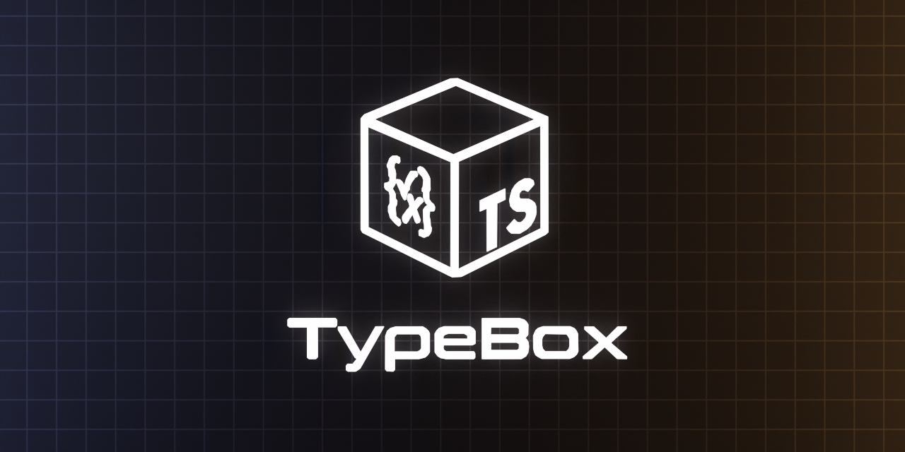

<div align='center'>

<h1>TypeBox</h1>

<p>JSON Schema Type Builder with Static Type Resolution for TypeScript</p>



<br />
<br />

[](https://badge.fury.io/js/typebox)
[](https://www.npmjs.com/package/typebox)
[](https://github.com/sinclairzx81/typebox/actions/workflows/build.yml)
[](https://opensource.org/licenses/MIT)

</div>

## Install

```bash
$ npm install typebox
```


## Usage

```typescript
import Type from 'typebox'

const T = Type.Object({                     // const T = {
  x: Type.Number(),                         //   type: 'object',
  y: Type.Number(),                         //   properties: {
  z: Type.Number()                          //     x: { type: 'number' },
})                                          //     y: { type: 'number' },
                                            //     z: { type: 'number' }
                                            //   },
                                            //   required: ['x', 'y', 'z']
                                            // }

type T = Type.Static<typeof T>              // type T = {
                                            //   x: number,
                                            //   y: number,
                                            //   z: number
                                            // }

```

## Overview

[Documentation](https://sinclairzx81.github.io/typebox/)

TypeBox is a runtime type system that creates in-memory JSON Schema objects that infer as TypeScript types. The schematics produced by this library are designed to match the static type checking rules of the TypeScript compiler. TypeBox offers a unified type that can be statically checked by TypeScript and runtime checked using standard JSON Schema validation.

This library is designed to allow JSON Schema to compose similar to how types compose within TypeScript's type system. It can be used as a simple tool to build up complex schematics or integrated into REST and RPC services to help validate data received over the wire.

License: MIT

## Contents

- [Type](#Type)
- [Script](#Script)
- [Schema](#Schema)
- [Versions](#Versions)
- [Contribute](#Contribute)


<a name="Type"></a>

## Type

[Documentation](https://sinclairzx81.github.io/typebox/#/docs/type/overview) | [Example](https://www.typescriptlang.org/play/?#code/JYWwDg9gTgLgBAFQJ5gKZwGZQiOByGFVAIwgA88AoSgehrgFonmXW32POvueHb7kafo16ix4ic2oBjCADsAzvACqC1FDgBeREQB0AeWIArVNJgAKAN5wbtu-Yc26cWYpVqN2y5RvAAJgBcOmi6AMowUMByAObmAJQANI7JKfbONoRoQXgQxqYweAk+cHIAhiCoQYKoYRFRsYmpTQ7pcGDYaLDAqApB3jaoIKXAADZVeuGRMVaY0EMw2YPDI3hwAL5xya2+gXDWmZX4SlPRq2tFG81X11v0dmUVfXAH2cf1Z0U3X99w23BLoyexR+INSfwyRFedRihTgwNBCLSd3sGDmpQW+ABKzhiNxdj+a3heIRrUJxLxrSgqAAjgBXYBU3YAbSJ5J+fzw-lhrLZXw5D1Q3N5JORNjwWKowtBrQAujypc1nIThJJVWr1XxnOF0cBpCqNQbDZxqAc4Kp1FpgjVtTBdQAeA4QDBmjwAPmuzlN5s8e3lCqarX8QTeMU+-u+rQFweh0TD4ZurSx0ZOfvjjiVQA)

TypeBox types are JSON Schema fragments that compose into more complex types. The library offers a set of types used to construct JSON Schema compliant schematics as well as a set of extended types used to model constructs native to the JavaScript language. The schematics produced by TypeBox can be passed directly to any JSON Schema compliant validator.

### Example

The following creates a User type and infers with Static.

```typescript
import Type from 'typebox'

// Type

const User = Type.Object({                       // const User = {
  id: Type.String(),                             //   type: 'object',
  name: Type.String(),                           //   properties: {
  email: Type.String({ format: 'email' })        //     id: { type: 'string' },
})                                               //     name: { type: 'string' },
                                                 //     email: { 
                                                 //       type: 'string', 
                                                 //       format: 'email' 
                                                 //     }
                                                 //   },
                                                 //   required: [
                                                 //     'id', 
                                                 //     'name', 
                                                 //     'email'
                                                 //   ]
                                                 // }

// Static

type User = Type.Static<typeof User>              // type User = {
                                                  //   id: string,
                                                  //   name: string,
                                                  //   email: string
                                                  // }

```

## Script

[Documentation](https://sinclairzx81.github.io/typebox/#/docs/script/overview) | [Example 1](https://www.typescriptlang.org/play/?target=99&module=7#code/JYWwDg9gTgLgBAFQJ5gKZwGZQiOByGFVAIwgA88AoSgehrgFkBDGAC0YgBMBXAG1WoBjCADsAzvGZs4AXkREAdAGVBUYGBgAKAAaU4cQmjgA1VIJjQALLLgBvOGQBccEdxDFUUADRwkz1+6ePgBe-m4e3nAA7mGBUHAAvnoGRCZmFlAAzDb2Ti7hQb6xESHFnonJhuim5tAATDkOZZF++XEV2gCU1HRwAOJQTGCswIJiHDz8QqIS-YPDo+NyyGjKqupaUqw+uvpVabCoZDnJ+pBiwDDAos41GZZepy7QIEy8t+nQmY-6+twAbh9alA6skkntUn1UDhUDAoEgTr84P9PFdBKgxB9DmQANoAXR+v2AIk4owxzXxYMqqSknmAb0RvyY7mAqBEMCB90J+lJGAw3DEqE5Vm5cDEaEEfCYUGFUEsVIhRgYGPYclsTwA5tCQLD4c4oTC4UhRa8YHS3s5aWo3lSutR9sqxKr5KslDAWKMADxVCAYOZDEZjHF4R2sPB4gB8+l6DpVjKRCcTSeTKZTvX0WsNerscAUecSotTReLJfTcFN5veObzCgqJfrDeTvQSQA) | [Example 2](https://www.typescriptlang.org/play/?target=99&module=7#code/JYWwDg9gTgLgBAFQJ5gKZwGZQiOByGFVAIwgA88AoSgehrgFkBDGAC0YgBMBXAG1WoBjCADsAzvABqqQTGgAWOAF5ERAHQB5YgCsZMABQBvOGQBcqtGoBy3EMVRR9ASgA0cJOeSWbdh87cAXp7qPvaOrnAA7sHetmHOcAC+TpTC4lJ60ADMyhaomjp6RiYx+aF+ER551nEVgaU1vuFJKWkScNKy0ABMuV75WrqyxWbV5eFuVf2N8U4t1HRwAOJQTGCswIJiHDz8QqLt0rCoZH3qg0WGlHBwkGLAMMCi5p1yUPIu13Ai0CBMvC9MlAsp8btwAG6ArpQbqUZKpA7wJaoHCoGBQJBnSwXYZXG7ghyPQSoMQNACCUFWSH0RxgJ1cX2AIk4mxJ5MpTGp03GzhS8La8GYdKgwH+WIGhVxXyYdmAqBEMChbw+XxZGAw3DEqCVClBcDEaEEfCYUB170+-MRjBJ7BU0xxBjxcAA5iiQGiMeZkaj0Ug9X9haKAYwWA4g3CUpRCGhrWJbdUAMowFibAA80ZRGFjrAAfDd8wXC4sM9nck7CxXK1XqzX84sbq6fZ64MY1G2knra13u1363AA2H-uZW+3El8exPJ3X6IkgA)

TypeBox includes a micro TypeScript engine that can transform TypeScript definitions to JSON Schema. The engine is fully type-safe and supports many programmable constructs including Conditional, Mapped, Indexed, Generics, Distributive Generics, and more.

### Example

Syntax highlighting is available via the [Visual Studio Marketplace](https://marketplace.visualstudio.com/items?itemName=sinclairzx81.typebox-script).

```typescript
import Type from 'typebox'

// Math Module

const Math = Type.Script(`
  type Vector4 = { x: number, y: number, z: number, w: number }
  type Vector3 = { x: number, y: number, z: number }
  type Vector2 = { x: number, y: number }
`)

// Graphics Module

const Graphics = Type.Script(Math, `
  type Vertex = {
    position: Vector4,
    normal: Vector3,
    uv: Vector2
  }
  type Geometry = {
    vertices: Vertex[],
    indices: number[]
  }
  type Material = {
    ambient: Vector4,
    diffuse: Vector4,
    specular: Vector4
  }
  type Mesh = {
    geometry: Geometry,
    material: Material
  }
`)

type Mesh = Type.Static<typeof Graphics['Mesh']>  // type Mesh = {
                                                  //   geometry: { ... },
                                                  //   material: { ... }
                                                  // }
```

<a name="Schema"></a>

## Schema

[Documentation](https://sinclairzx81.github.io/typebox/#/docs/schema/overview) | [Example 1](https://www.typescriptlang.org/play/#code/JYWwDg9gTgLgBAZQMYAsCmICGcBmUIhwDkMAnmGgEYQAeA9AM6oaZEBQbddcAtH-wMFDhI0WPESenbgGECYYABs003pPUbNW-hyQQAdg3gBVBmihwAvImZYAdHPBK0ACgDebOHDIUAXMQhKACs0JBgiABpPODB8ClhgNAZ-Dy8vYAATFO9yNH8iIyhgfQBzIjgAXyi0uH1MEDy4Nxy-YkLissrqtJYlbJ9Ggpgi0sjcaCwYfN7FcoroquioNABHAFdgZay4AG1oryJMsf3iOobjmqIZ9i8AXTYKgEoOLjVtd4+P1QAFTCgzVSfIHAyS6AxGOBrMwWaymcx2X7-VzNGqotHouCvPSGeBQ8wpaKZfIANgArDgAIyYABMlAAzEgACwZUloYk4ADsmAAHJQAJxIAAMGQpYwx6Ne6W27VK3TOgzxUDF4pVqq8ktq9UaMpK3Rm+UVAAEMgRMMU7HoQOU1SqNfq4DqHo8bS7XajXhUrHA7D6gA) | [Example 2](https://www.typescriptlang.org/play/?#code/JYWwDg9gTgLgBAZQMYAsCmICGcBmUIhwDkMAnmGgEYQAeA9AM6oaZEBQokscAKuWrnyES-ajXZs6dOAFo58hYqXKVqteo0zJ0gMIEwwADZptszeYuWr8tmyQQAdg3gBVBmihwAvImZYAdHrgRmgAFHwU-gDylABWaEgwoQDebHBwwAAmAFy8-P4IMFDADgDmoQCUADRpcA6YIGi5EWgFRSXl1bUsRs35hcVlKbjQWDC5RD2GRHAAvhVs8wum1qtr61pScAAKmFDuKxtHx6q29k7wAK7unj5uHv67+2HJ6W-vH5-vW+fOcNceXKpdJZCYANgArDgAIyYABMlAAzEgACyZCFoME4ADsmAAHJQAJxIAAMmWhRCqX2pcC2IJycGcg1KNXS9UaEwBUEpNN5fO+0jZDSajPaZVZcCmnJuAAFMgRMCV-PYQDN+by6ZKsL1RczFhV1YajR8trNvHB-JagA)

TypeBox includes a high-performance JIT compiler that supports JSON Schema Draft 3 through to 2020-12. It is designed to be a lightweight industry-grade alternative to Ajv and offers improved compilation and validation performance. It also provides automatic fallback to dynamic validation in JIT restricted environments such as Cloudflare Workers.

The compiler is available via optional sub module import.

```typescript
import Schema from 'typebox/schema'
```

### Compile

The compiler accepts either TypeBox types or native JSON Schema.

```typescript

// Type

const VectorA = Schema.Compile(Type.Object({       // const VectorA: Validator<TObject<{
  x: Type.Number(),                                //   x: TNumber
  y: Type.Number(),                                //   y: TNumber
  z: Type.Number()                                 //   z: TNumber
}))                                                // }>>

// Schema

const VectorB = Schema.Compile({                   // const VectorB: Validator<{
  type: 'object',                                  //   type: "object";
  required: ['x', 'y', 'z'],                       //   required: ["x", "y", "z"];
  properties: {                                    //   properties: { ... };
    x: { type: 'number' },                         // }, { ... }>
    y: { type: 'number' },
    z: { type: 'number' }
  }
})
```

### Validate

Compiled validator instances provide functions to Check and Parse values.

```typescript

// Compile

const Vector = Schema.Compile(Type.Script(`{
  x: number
  y: number
  z: number
}`))

// Check

const valid = Vector.Check({ x: 1, y: 0, z: 0 })   // const valid: boolean

// Parse

const result = Vector.Parse({ x: 1, y: 0, z: 0 })  // const result: {      
                                                   //   x: number
                                                   //   y: number
                                                   //   z: number
                                                   // }
```

### Coverage

[JSON Schema Test Suite](https://github.com/json-schema-org/JSON-Schema-Test-Suite) | [JSON Schema Compliance Suite](https://github.com/sinclairzx81/json-schema-compliance-suite)

TypeBox supports all major JSON Schema draft versions and tracks compliance against the official JSON Schema Test Suite. It also maintains a separate JavaScript compliance suite to track ecosystem adoption as JSON Schema moves toward the V1 candidate. The following table shows TypeBox specification coverage.

| Spec | 3 | 4 | 6 | 7 | 2019-09 | 2020-12 | v1 |
|:-----|:--|:--|:--|:--|:--|:--|:--|
| additionalItems | ✅ | ✅ | ✅ | ✅ | ✅ | - | - |
| additionalProperties | ✅ | ✅ | ✅ | ✅ | ✅ | ✅ | ✅ |
| allOf | - | ✅ | ✅ | ✅ | ✅ | ✅ | ✅ |
| anchor | - | - | - | - | ✅ | ✅ | ✅ |
| anyOf | - | ✅ | ✅ | ✅ | ✅ | ✅ | ✅ |
| boolean_schema | - | - | ✅ | ✅ | ✅ | ✅ | ✅ |
| const | - | - | ✅ | ✅ | ✅ | ✅ | ✅ |
| contains | - | - | ✅ | ✅ | ✅ | ✅ | ✅ |
| content | - | - | - | - | ✅ | ✅ | ✅ |
| default | ✅ | ✅ | ✅ | ✅ | ✅ | ✅ | ✅ |
| dependencies | 17/18 | ✅ | ✅ | ✅ | - | - | - |
| dependentRequired | - | - | - | - | ✅ | ✅ | ✅ |
| dependentSchemas | - | - | - | - | ✅ | ✅ | ✅ |
| dynamicRef | - | - | - | - | - | 40/44 | 21/27 |
| enum | 14/16 | ✅ | ✅ | ✅ | ✅ | ✅ | ✅ |
| exclusiveMaximum | - | - | ✅ | ✅ | ✅ | ✅ | ✅ |
| exclusiveMinimum | - | - | ✅ | ✅ | ✅ | ✅ | ✅ |
| if-then-else | - | - | - | ✅ | ✅ | ✅ | ✅ |
| infinite-loop-detection | ✅ | ✅ | ✅ | ✅ | ✅ | ✅ | ✅ |
| items | ✅ | ✅ | ✅ | ✅ | ✅ | ✅ | ✅ |
| maxContains | - | - | - | - | ✅ | ✅ | ✅ |
| maximum | 13/14 | 13/14 | ✅ | ✅ | ✅ | ✅ | ✅ |
| maxItems | ✅ | ✅ | ✅ | ✅ | ✅ | ✅ | ✅ |
| maxLength | ✅ | ✅ | ✅ | ✅ | ✅ | ✅ | ✅ |
| maxProperties | - | ✅ | ✅ | ✅ | ✅ | ✅ | ✅ |
| minContains | - | - | - | - | ✅ | ✅ | ✅ |
| minimum | 12/13 | 16/17 | ✅ | ✅ | ✅ | ✅ | ✅ |
| minItems | ✅ | ✅ | ✅ | ✅ | ✅ | ✅ | ✅ |
| minLength | ✅ | ✅ | ✅ | ✅ | ✅ | ✅ | ✅ |
| minProperties | - | ✅ | ✅ | ✅ | ✅ | ✅ | ✅ |
| multipleOf | - | ✅ | ✅ | ✅ | ✅ | ✅ | ✅ |
| not | - | ✅ | ✅ | ✅ | ✅ | ✅ | ✅ |
| oneOf | - | ✅ | ✅ | ✅ | ✅ | ✅ | ✅ |
| pattern | ✅ | ✅ | ✅ | ✅ | ✅ | ✅ | ✅ |
| patternProperties | ✅ | ✅ | ✅ | ✅ | ✅ | ✅ | ✅ |
| prefixItems | - | - | - | - | - | ✅ | ✅ |
| properties | ✅ | ✅ | ✅ | ✅ | ✅ | ✅ | ✅ |
| propertyNames | - | - | ✅ | ✅ | ✅ | ✅ | ✅ |
| recursiveRef | - | - | - | - | ✅ | - | - |
| ref | 22/27 | 37/45 | 67/70 | 75/78 | 79/81 | 77/79 | 78/79 |
| required | 3/4 | ✅ | ✅ | ✅ | ✅ | ✅ | ✅ |
| type | 73/80 | ✅ | ✅ | ✅ | ✅ | ✅ | ✅ |
| unevaluatedItems | - | - | - | - | ✅ | ✅ | 70/71 |
| unevaluatedProperties | - | - | - | - | ✅ | ✅ | 128/129 |
| uniqueItems | ✅ | ✅ | ✅ | ✅ | ✅ | ✅ | ✅ |

### Performance

TypeBox tracks comparative performance against AJV8 as the de facto performance standard. For broader comparative benchmarks, refer to the community maintained projects below.

[Runtime Benchmarks](https://moltar.github.io/typescript-runtime-type-benchmarks/) | [Schema Benchmarks](https://schemabenchmarks.dev/)

The following table shows compilation performance for various JSON Schema structures. These benchmarks measure the time required to JIT compile schematics, with faster compilation resulting in faster application startup.

```python
┌──────────────────────┬──────────────┬──────────────┐
│ Compile              │ TB1X         │ AJV8         │
├──────────────────────┼──────────────┼──────────────┤
│ Boolean              │  50.4K ops/s │   7.1K ops/s │
│ Number               │ 129.9K ops/s │   7.9K ops/s │
│ String               │ 128.9K ops/s │   9.1K ops/s │
│ Null                 │  91.3K ops/s │   8.4K ops/s │
│ Literal_String       │  63.1K ops/s │   7.4K ops/s │
│ Literal_Number       │  74.5K ops/s │   7.6K ops/s │
│ Literal_Boolean      │ 143.3K ops/s │   7.7K ops/s │
│ Pattern              │  94.2K ops/s │   6.4K ops/s │
│ Object_Open          │  19.4K ops/s │   1.3K ops/s │
│ Object_Close         │  17.6K ops/s │    991 ops/s │
│ Object_Vector3       │  46.1K ops/s │   3.3K ops/s │
│ Object_Basis3        │    16K ops/s │    848 ops/s │
│ Intersect_And        │  41.3K ops/s │   4.2K ops/s │
│ Intersect_Structural │  25.3K ops/s │   1.5K ops/s │
│ Union_Or             │  58.6K ops/s │   2.4K ops/s │
│ Union_Structural     │  31.5K ops/s │   1.8K ops/s │
│ Tuple_Values         │  18.2K ops/s │   1.9K ops/s │
│ Tuple_Objects        │   3.9K ops/s │    437 ops/s │
│ Array_Numbers_4      │ 114.5K ops/s │   4.2K ops/s │
│ Array_Numbers_8      │ 128.3K ops/s │   3.9K ops/s │
│ Array_Numbers_16     │ 128.4K ops/s │     4K ops/s │
│ Array_Objects_Open   │    22K ops/s │    780 ops/s │
│ Array_Objects_Close  │    22K ops/s │     1K ops/s │
└──────────────────────┴──────────────┴──────────────┘
```

The following tables shows validation performance for various JSON Schema structures. These benchmarks measure overall validation throughput for JIT compiled schematics.

```python
┌──────────────────────┬──────────────┬──────────────┐
│ Validate             │ TB1X         │ AJV8         │
├──────────────────────┼──────────────┼──────────────┤
│ Boolean              │ 192.2M ops/s │ 189.5M ops/s │
│ Number               │ 112.4M ops/s │    61M ops/s │
│ String               │ 113.7M ops/s │  64.1M ops/s │
│ Null                 │ 112.8M ops/s │  64.9M ops/s │
│ Literal_String       │   108M ops/s │  62.9M ops/s │
│ Literal_Number       │ 113.5M ops/s │  63.2M ops/s │
│ Literal_Boolean      │ 109.2M ops/s │  64.1M ops/s │
│ Pattern              │  26.5M ops/s │  22.4M ops/s │
│ Object_Open          │    78M ops/s │  47.2M ops/s │
│ Object_Close         │  38.6M ops/s │  27.6M ops/s │
│ Object_Vector3       │    91M ops/s │  51.3M ops/s │
│ Object_Basis3        │  41.1M ops/s │  27.4M ops/s │
│ Intersect_And        │ 107.6M ops/s │  59.9M ops/s │
│ Intersect_Structural │  83.6M ops/s │  46.3M ops/s │
│ Union_Or             │    95M ops/s │   7.9M ops/s │
│ Union_Structural     │  84.5M ops/s │  52.3M ops/s │
│ Tuple_Values         │  74.7M ops/s │    53M ops/s │
│ Tuple_Objects        │  32.9M ops/s │  22.3M ops/s │
│ Array_Numbers_4      │  93.3M ops/s │  55.1M ops/s │
│ Array_Numbers_8      │  90.3M ops/s │  50.8M ops/s │
│ Array_Numbers_16     │  76.8M ops/s │  39.6M ops/s │
│ Array_Objects_Open   │  28.7M ops/s │  20.4M ops/s │
│ Array_Objects_Close  │  10.3M ops/s │  10.8M ops/s │
└──────────────────────┴──────────────┴──────────────┘
```

<a name="Versions"></a>

## Versions

TypeBox ships two distinct versions that span two generations of the TypeScript compiler. 

| TypeBox | TypeScript | Description |
| :--- | :--- | :--- |
| 1.x | 6.0 - 7.0+ | **Latest.** Developed against the TypeScript 7 native compiler. Provides advanced type inference and native JSON Schema 2020-12 support. Includes backwards compatibility with `0.x` types. **ESM only.** |
| 0.x | 5.0 - 6.0 | **LTS.** Developed against older TypeScript versions and actively maintained under Long Term Support. Compatible with both **ESM and CJS**. Issues should be submitted to the [Sinclair TypeBox](https://github.com/sinclairzx81/sinclair-typebox) repository. |

## Contribute

TypeBox is open to community contribution. Please ensure you submit an issue before submitting a pull request. The TypeBox project prefers open community discussion before accepting new features.