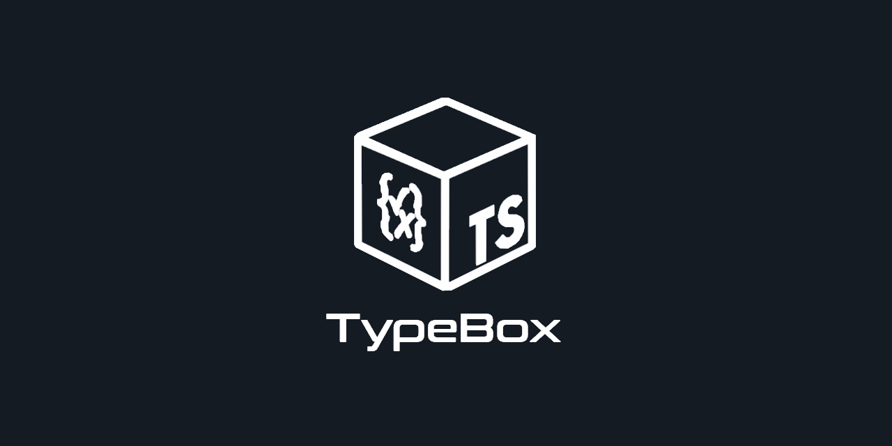

<div align='center'>

<h1>TypeBox</h1>

<p>A Runtime Type System for JavaScript</p>



<br />
<br />

[](https://badge.fury.io/js/typebox)
[](https://www.npmjs.com/package/typebox)
[](https://github.com/sinclairzx81/typebox/actions/workflows/build.yml)
[](https://opensource.org/licenses/MIT)

</div>

## Install

```bash
$ npm install typebox --save                        # 1.0.0

$ npm install @sinclair/typebox --save              # 0.34.x
```


## Usage

```typescript
import Type, { type Static } from 'typebox'

const T = Type.Object({                             // const T = {
  x: Type.Number(),                                 //   type: 'object',
  y: Type.Number(),                                 //   required: ['x', 'y', 'z'],
  z: Type.Number(),                                 //   properties: {
})                                                  //     x: { type: 'number' },
                                                    //     y: { type: 'number' },
                                                    //     z: { type: 'number' }
                                                    //   }
                                                    // }

type T = Static<typeof T>                           // type T = {
                                                    //   x: number,
                                                    //   y: number,
                                                    //   z: number
                                                    // }
```

## Overview

[Documentation](https://sinclairzx81.github.io/typebox/) | [1.0 Migration Guide](https://github.com/sinclairzx81/typebox/blob/main/changelog/1.0.0-migration.md)

TypeBox is a runtime type system that creates in-memory Json Schema objects that infer as TypeScript types. The schematics produced by this library are designed to match the static type checking rules of the TypeScript compiler. TypeBox offers a unified type system that can be statically checked by TypeScript and validated at runtime using standard Json Schema.

This library is designed to allow Json Schema to compose similar to how types compose within TypeScript's type system. It can be used as a simple tool to build up complex schematics or integrated into REST and RPC services to help validate data received over the wire.


License: MIT

## Contents

- [Type](#Type)
- [Script](#Script)
- [Value](#Value)
- [Compile](#Compile)
- [Contribute](#Contribute)


<a name="Type"></a>

## Type

[Documentation](https://sinclairzx81.github.io/typebox/#/docs/type/overview) | [Example](https://www.typescriptlang.org/play/?#code/JYWwDg9gTgLgBAFQJ5gKYBo4G84xauAZRgEMZgBjOAXzgDMoIQ4ByPNAIwgA8WAoPhQgA7AM7wEcALyJ8AOgDyHAFaoKMABQ44O3Xv0HDAeiNwhYidOx8d3AFyy0cgHIBXEB1RQNASkyGAwICTXXZUBxYIFTUYFnQbOCQHZCc3Dy9ffyDsoJCdKFQAR1dgAoATBwBtFl5MFiQ41gAvFgBdeJ0m5Pk0z28fHMHAvLgwRjRYYFRRByw+agGhpeW9EdtZ3HwI4Xc+lhoOlaPltcSNsO3dr33qQ+P77NOu7E20S-SoG4SHn+NTHWo31+wJ0IUBfDCiCsxDIlAAPGEIHREAA+EGg0yQyQyObo9EjexwHYfO54n4jJJEq5QUlk+4jZ7EvpAunHMFAA)

TypeBox includes many functions to create Json Schema types. Each function returns a small Json Schema fragment that corresponds to a TypeScript type. TypeBox uses function composition to combine schema fragments into more complex types. It provides a set of functions that are used to model Json Schema schematics as well as a set of functions that model constructs native to JavaScript and TypeScript.

## Example

The following creates a Json Schema type and infers with Static.

```typescript
import Type, { type Static } from 'typebox'

const T = Type.Object({                             // const T = {
  x: Type.Number(),                                 //   type: 'object',
  y: Type.Number(),                                 //   required: ['x', 'y', 'z'],
  z: Type.Number()                                  //   properties: {
})                                                  //     x: { type: 'number' },
                                                    //     y: { type: 'number' },
                                                    //     z: { type: 'number' }
                                                    //   }
                                                    // }

type T = Static<typeof T>                           // type T = {
                                                    //   x: number,
                                                    //   y: number,
                                                    //   z: number
                                                    // }
```


<a name="Script"></a>

## Script

[Documentation](https://sinclairzx81.github.io/typebox/#/docs/script/overview) | [Example](https://www.typescriptlang.org/play/?#code/JYWwDg9gTgLgBAFQJ5gKYBo4G84xauAZRgEMZgBjOAXzgDMoIQ4ByPNAIwgA8WAoPhQgA7AM7wEcALyJ8AOkIUowMDAAUAAxx84cbgC44wgK4gOqKJh1wkhk2YtXdALzunzUOH2oaAlLoDAoOCQ0LCggHoIuCExCWlEAHkOACtUChgAHixrcLz8gsCogINEADl3R1zCmtqi6N1bcsrLarr2guKXQwQKhyg2jqHQ4uoAPgFY8SIE5DQFJRV1HElqTC1rAG0AaThgYTgAa1QkCDpEAF0enYu4AB8jYwAbJ+8-YY-g4qn4Qh7ktIZbKDT6fLp6HoAVWEwBEmU2vRamERLwuY3QINBw3BTQQ0NhwnhiP6yIqqPRmKxHXBrkQ+LhCL6HlJzyeaMpVLqowmfHYBEICWIZEomT5ZyIY05xT5MxkOU5WPBpXsHnujxeGIVoJxbn6apMGo5Ws6DTgtJVFn1rKNxryowEfCAA)

TypeBox is a runtime type system that uses Json Schema as an AST for runtime type representation. The Script function provides a syntactic frontend to the type system and allows Json Schema to be created using native TypeScript syntax. TypeBox provides full static and runtime type safety for string-encoded types.

### Example

The following uses Script to create and map types.

```typescript
import Type, { type Static } from 'typebox'

const T = Type.Script(`{ 
  x: number, 
  y: number, 
  z: number 
}`)                                                 // const T = TObject<{
                                                    //   x: TNumber,
                                                    //   y: TNumber,
                                                    //   z: TNumber
                                                    // }>

const S = Type.Script({ T }, `{
  [K in keyof T]: T[K] | null
}`)                                                 // const S: TObject<{
                                                    //   x: TUnion<[TNumber, TNull]>,
                                                    //   y: TUnion<[TNumber, TNull]>,
                                                    //   z: TUnion<[TNumber, TNull]>
                                                    // }>

type S = Static<typeof S>                           // type S = {
                                                    //   x: number | null,
                                                    //   y: number | null,
                                                    //   z: number | null
                                                    // }
```

<a name="Value"></a>

## Value

[Documentation](https://sinclairzx81.github.io/typebox/#/docs/value/overview) | [Example](https://www.typescriptlang.org/play/?#code/JYWwDg9gTgLgBAFQJ5gKZwGZQiOByGFVAIwgA88AoUSWOANQEMAbAV3Sx30LVLIHoAbi3ZVKAYwgA7AM7wEcALyIiAOgDyxAFapxMABQBvSnDhkAXCrSqAcqxDFUUfQEoANCbhJLya3YdOrh6mAF4+av6Ozi6UAL4xlPz8cADCABa6ANaUEtJycACCSgwiqKrpWfoIbnCGpvUNjU1NSXCSsvAFlqQQzKiMUsUwUOyeFnAAjDXNM7Nzs57ecABMwXBhcADMcQmtAAqMUDKoOe35AELFTGxlB0eoVTV18y+mrWfw55bGpuNTrwDAfVWr9LFJ7FE1ktVkDYS8QV4wRCnGsNps4RjZgiNuCAlAdpjCVjkrFiqpyUA)

The TypeBox Value module provides functions to Check and Parse JavaScript values. It also includes functions such as Clone, Repair, Encode, Decode, Diff and Patch which perform various structural operations on JavaScript values. This module provides unified support for both Json Schema and Standard Schema.

The Value module is available via optional import.

```typescript
import Value from 'typebox/value'
```

### Example

The following uses the Value module to Check and Parse a value. 

```typescript
const T = Type.Object({
  x: Type.Number(),
  y: Type.Number(),
  z: Type.Number()
})

// Check

const A = Value.Check(T, {                          // const A: boolean = true
  x: 1,                                            
  y: 2,
  z: 3
})

// Parse

const B = Value.Parse(T, {                          // const B: {
  x: 1,                                             //   x: number,
  y: 2,                                             //   y: number,
  z: 3                                              //   z: number
})                                                  // } = ...
```


<a name="Compile"></a>

## Compile

[Documentation](https://sinclairzx81.github.io/typebox/#/docs/compile/overview) | [Example](https://www.typescriptlang.org/play/?#code/JYWwDg9gTgLgBAbzgYQuYAbApnAvnAMyjTgHIYBPMLAIwgA8B6AYzTEy1IChRJY4AKlRxES5YXXrcurAHYBneMjgBeFGw4AKIdQB0AeRoArLMxiakcK9Zu3bjRnDmKUALjgA1AIYZgAEy8YaAAeBFwAGkFDEzNQrit6dx0sXQA5AFcQGiwoTQBKSLsi4pKrB2tEwQysnPD4uAok4TTM7NyC0s6u8qtGqtba+oAvJr1qtvyuqZKeuBH+mqguXDy86fWNm3LcAD4dri5y5AALUwBrA+d4AEFVFF0T84tNjfKruGv3OghsL1k7mBQdJYeqVACMhReUNs9T6ACY6lZ5gBmZZ5A7lAAKXig8hBMggCngACE7shdNjcVhntDuo53sT3AhQe4IbT2WVHAl3LIBlBEQ13AiOezZn1eYsBSiRaKuXMeXy0TKZds7rp1UA)

The TypeBox Compile module provides functions to convert types into high-performance validators. The compiler is tuned for fast compilation as well as fast validation. This module provides unified support to compile both Json Schema and Standard Schema, however performance optimizations are only possible with Json Schema.

The Compile module is available via optional import.

```typescript
import { Compile } from 'typebox/compile' 
```

### Example

The following uses the Compile module to Check and Parse a value. 

```typescript
const C = Compile(Type.Object({                     // const C: Validator<{}, TObject<{
  x: Type.Number(),                                 //   x: TNumber,
  y: Type.Number(),                                 //   y: TNumber,
  z: Type.Number()                                  //   z: TNumber
}))                                                 // }>>

// Check

const A = C.Check({                                 // const A: boolean = true
  x: 1,                                            
  y: 2,
  z: 3
})

// Parse

const B = C.Parse({                                 // const B: {
  x: 1,                                             //   x: number,
  y: 2,                                             //   y: number,
  z: 3                                              //   z: number
})                                                  // } = ...
```

## Contribute

TypeBox is open to community contribution. Please ensure you submit an issue before submitting a pull request. The TypeBox project prefers open community discussion before accepting new features.